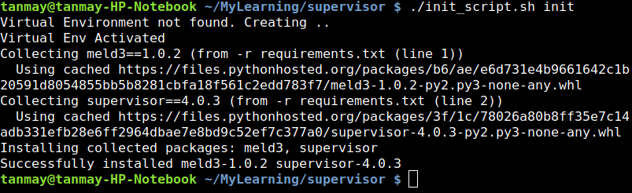
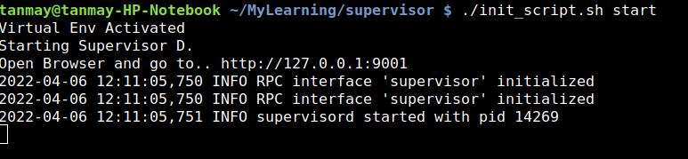
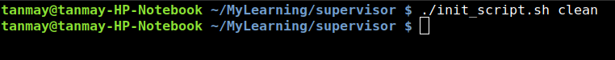

# Supervisor D
A Process Control System

Supervisor is a client/server system that allows its users to monitor and control a number of processes on UNIX-like operating systems.

## Python Version
* Python 3.6.9

## Python Libraries
* supervisor
* meld

## Initial Setup
Run the script
`./init_script.sh init`

This will create a python virtual environment and install all the required pip packages

## Start

To start the supervisorD process control run the script with argument start
`./init_script.sh start`

## Clean

If you want to clean the virtual environment
`./init_script.sh clean`

